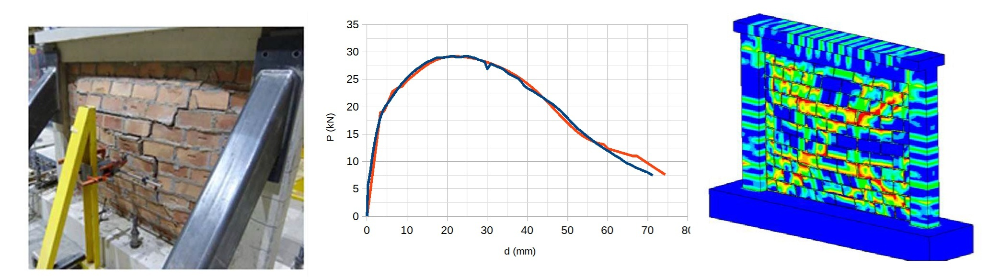
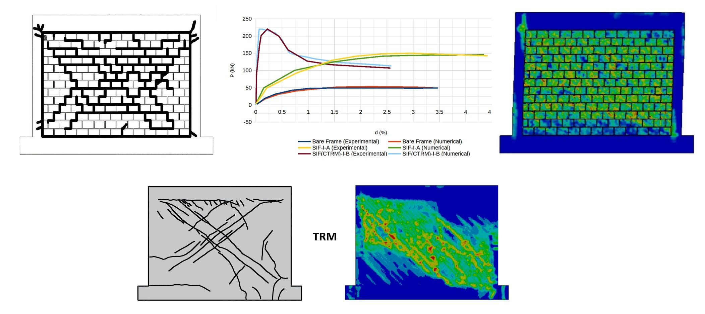
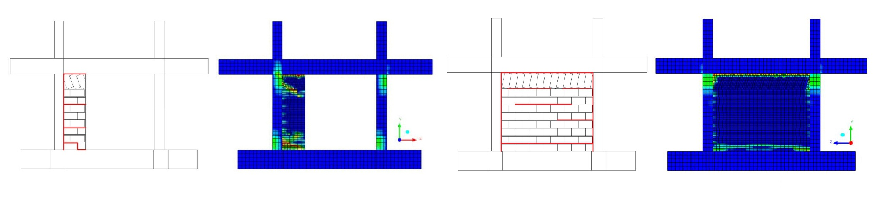

# FRESCO Database

**An open database for fiber and polymer strengthening of infilled RC frame systems**

[](https://opensource.org/licenses/MIT)

## Overview

FRESCO (Fiber REinforced Strengthening COmposite Database) is a comprehensive open-source database designed to systematically organize experimental data on infilled RC frame systems, with integrated modeling capabilities for simulating advanced composite strengthening interventions such as Fiber Reinforced Polymers (FRP), Textile Reinforced Mortars (TRM), and other fiber-based solutions. The database employs open-source practices while providing high-quality output that is fully compatible with leading software packages such as ANSYS SpaceClaim.

## Features

- **Comprehensive Data Organization**: Systematic documentation of experimental data for infilled RC frame 
- **Automated 3D Modeling**: Converts experimental data into detailed finite element ready models with solid RC frame geometry, reinforcement details, and infill configurations
- **Integrated Strengthening Capabilities**: Built-in modeling options for simulating composite retrofitting interventions including FRP wrapping for columns/beams and TRM/FRP applications for infills
- **Multi-format Support**: Provides data in both comma-separated (.csv) and JSON (.json) formats for easy interaction and programmatic access
- **Open Source Framework**: Built using Python as the main programming language and FreeCAD as the model generation engine

<p align="left">
  
</p>

## Citation

If you use FRESCO in your research, please cite it using the following format:

> COMING SOON

For BibTeX:
> COMING SOON

## Installation

### Prerequisites

- FreeCAD v1.0 (download from freecad.org)
- Visual Studio Code (download from code.visualstudio.com)

### Install from Source

```bash
git clone https://github.com/Vachan-Vanian/FRESCO-database.git
cd FRESCO-database
# Then open in Visual Studio Code
```

## Quick Start

### Adding Your First Entry

**Step 1: Use the Template**

Start with the template from `Examples/Templates/TEMPLATE_RCF.py`:

```python
import copy
from Examples.Templates.TEMPLATE_RCF import TEMPLATE_RCF


# Create your entry by copying the template
my_entry = copy.deepcopy(TEMPLATE_RCF)
```

**Step 2: Fill in the Required Fields**

```python
my_entry.update({
    # Reference information
    "specimen_id": "TEST-01",
    "year": 2025,
    "source": "https://doi.org/example",
    "title": "My Test Specimen",
    "authors": "Smith, J., Doe, A.",
    
    # Frame geometry (you can specify units!)
    "frm_h": [1500, "mm"],     # Frame height
    "frm_l": [2100, "mm"],     # Frame length
    "col_h": [200, "mm"],      # Column height
    "col_d": [140, "mm"],      # Column depth
    "bm_h": [250, "mm"],       # Beam height
    "bm_t": [140, "mm"],       # Beam thickness
    
    # Or use simple values (uses database default units)
    "bbm_h": 250,              # Base beam height (mm)
    "bbm_t": 540,              # Base beam thickness (mm)
})
```

**Step 3: Add to Database**

```python
db.add_entry(
    entry_id=1,
    entry_data=my_entry,
    overwrite=False,           # Set True to replace existing
    show_error_fields=True     # Show validation errors
)
```


## Examples

<figure>
  
  <figcaption align="left">FRESCO Example-1</figcaption>
</figure>

<figure>
  
  <figcaption align="left">FRESCO Example-2</figcaption>
</figure>

<figure>
  
  <figcaption align="left">FRESCO Example-3</figcaption>
</figure>


## Dependencies

FRESCO is built on top of several powerful libraries:

- **Python 3.11+**: Core programming language
- **FreeCAD v1.0**: Model generation engine using Python API

## Documentation

- [User Guide](UserGuide.md) - Detailed documentation for database usage
- [Contribution Guidelines](CONTRIBUTING.md) - How to contribute to the database
- [Examples](Examples/)

## Contributing

We welcome contributions to expand and improve the FRESCO database! Please see our [Contributing Guide](CONTRIBUTING.md) for details on how to add new entries, update existing data, or enhance documentation.

## License

This project is licensed under the MIT License - see the [LICENSE](LICENSE) file for details.

## Changelog

### Version 1.0
- Initial release of FRESCO database with core functionality
- Support for CSV and JSON formats
- Automated 3D modeling capabilities
- Integrated strengthening capabilities
- Validation examples for out-of-plane, in-plane, and spatial specimens

## Support

If you encounter any issues or have questions:

1. Check the [Documentation](UserGuide.md)
2. Search [Issues](https://github.com/Vachan-Vanian/FRESCO-database/issues)
3. Create a new issue if needed

## Acknowledgments

The research project is implemented in the framework of H.F.R.I call "Basic research Financing (Horizontal support of all Sciences)" under the National Recovery and Resilience Plan "Greece 2.0" funded by the European Union—NextGenerationEU (H.F.R.I. Project Number: 015376).

<p align="center">
  
  &nbsp;&nbsp;&nbsp;&nbsp;
  
</p>

<p align="center">
  
</p>